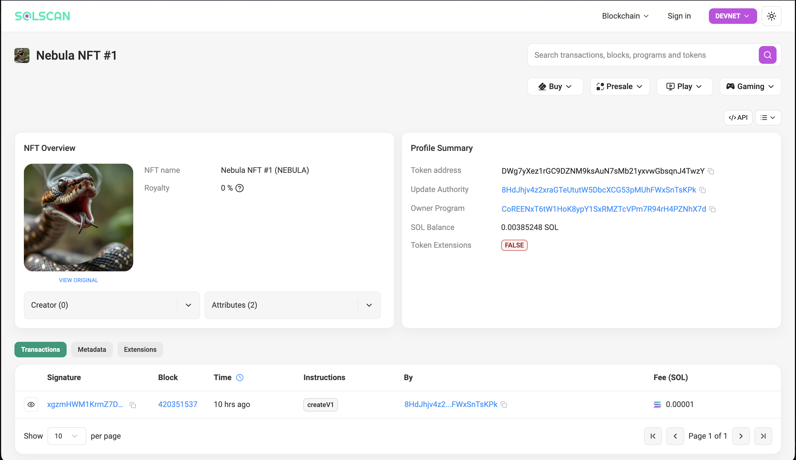

# Nebula NFT - Solana Devnet Minting

A TypeScript-based NFT minting project using Metaplex Core on Solana Devnet. This project demonstrates how to mint NFTs with metadata stored on IPFS via Pinata.

## Minted NFT



**NFT Address:** `DWg7yXez1rGC9DZNM9ksAuN7sMb21yxvwGbsqnJ4TwzY`

**View on Explorers:**
- [Metaplex Core Explorer](https://core.metaplex.com/explorer/DWg7yXez1rGC9DZNM9ksAuN7sMb21yxvwGbsqnJ4TwzY?env=devnet) (Recommended for Core NFTs)
- [Solscan](https://solscan.io/token/DWg7yXez1rGC9DZNM9ksAuN7sMb21yxvwGbsqnJ4TwzY?cluster=devnet)
- [XRAY](https://xray.helius.xyz/token/DWg7yXez1rGC9DZNM9ksAuN7sMb21yxvwGbsqnJ4TwzY?network=devnet)
- [Solana Explorer](https://explorer.solana.com/address/DWg7yXez1rGC9DZNM9ksAuN7sMb21yxvwGbsqnJ4TwzY?cluster=devnet)

## Features

- Mint NFTs using Metaplex Core
- Metadata hosted on IPFS via Pinata
- Deployed on Solana Devnet
- TypeScript implementation
- Configurable NFT attributes (name, symbol, royalties)

## Prerequisites

- Node.js (v16 or higher)
- npm or yarn
- Solana CLI
- Solana wallet with devnet SOL
- Pinata account for IPFS hosting

## Installation

Clone the repository:
```bash
git clone <your-repo-url>
cd nft-mint
```

Install dependencies:
```bash
npm install
```

Set up your Solana wallet:
```bash
# Generate a new devnet wallet (if you don't have one)
solana-keygen new --outfile ~/.config/solana/devnet.json

# Set Solana to devnet
solana config set --url https://api.devnet.solana.com

# Airdrop devnet SOL
solana airdrop 2 --keypair ~/.config/solana/devnet.json
```

## Project Structure

```
nft-mint/
├── src/
│   └── mint.ts          # Main minting script
├── metadata.json        # NFT metadata template
├── package.json         # Project dependencies
├── tsconfig.json        # TypeScript configuration
└── README.md           # This file
```

## NFT Metadata

The NFT metadata is hosted on Pinata IPFS.

**Metadata URI:** 
```
https://scarlet-imaginative-guineafowl-522.mypinata.cloud/ipfs/bafkreifqgslcxfkrvojzns7f5yolayztaumu7p4msxhllnrz4c3hapj73y
```

**Image URI:**
```
https://scarlet-imaginative-guineafowl-522.mypinata.cloud/ipfs/bafkreieq5sqq6dunimmqiwj72m3jkgwyjarqnxjvo7d5puvl6fru7fzon4
```

Metadata structure:
```json
{
  "name": "Nebula NFT #1",
  "symbol": "NEBULA",
  "description": "A cosmic NFT minted on Solana Devnet by Aditya Varshney",
  "image": "<ipfs-image-url>",
  "attributes": [
    { "trait_type": "Energy", "value": "High" },
    { "trait_type": "Rarity", "value": "Legendary" }
  ]
}
```

## Usage

1. Update the metadata in `metadata.json` (if needed)

2. Upload your image and metadata to Pinata

3. Update the URI in `src/mint.ts`:
```typescript
uri: "YOUR_PINATA_METADATA_URI_HERE"
```

4. Run the minting script:
```bash
npx tsx src/mint.ts
```

5. Wait for confirmation and check the console output for your NFT address and explorer links

## Configuration

Key parameters in `mint.ts`:

| Parameter | Description | Default |
|-----------|-------------|---------|
| `name` | NFT name | "Nebula NFT #1" |
| `uri` | Metadata URI (Pinata/IPFS) | Your Pinata link |
| `plugins.Royalties.basisPoints` | Royalty percentage (500 = 5%) | 500 |
| `plugins.Royalties.creators` | Array of creator addresses and percentages | Your wallet at 100% |
| `plugins.Royalties.ruleSet` | Royalty enforcement rule | "None" |

### Royalty Configuration

Core NFTs use the **Royalties Plugin** to set creator royalties. The configuration includes:

- **basisPoints**: Royalty percentage (100 basis points = 1%)
  - Example: 500 = 5%, 450 = 4.5%, 1000 = 10%
- **creators**: Array of creator addresses with their percentage split
  - Total percentages must equal 100
- **ruleSet**: Enforcement rules ("None", "ProgramAllowList", "ProgramDenyList")

## Tech Stack

- [Solana](https://solana.com/) - Blockchain platform
- [Metaplex Core](https://developers.metaplex.com/core) - NFT standard
- [@metaplex-foundation/umi](https://github.com/metaplex-foundation/umi) - Unified Metaplex Interface
- [Pinata](https://pinata.cloud/) - IPFS pinning service
- TypeScript - Programming language
- tsx - TypeScript execution

## Troubleshooting

### Image Not Showing in Explorer

If your NFT minted successfully but the image doesn't appear:

1. Wait 15-30 minutes for explorers to index metadata from IPFS
2. Clear browser cache and refresh
3. Try Metaplex Core Explorer (best for Core NFTs) or alternative explorers like Solscan and XRAY
4. Verify metadata URI is publicly accessible
5. Check that image URL loads in browser

### Common Issues

| Issue | Solution |
|-------|----------|
| "Insufficient funds" | Airdrop more devnet SOL |
| "Keypair not found" | Check wallet path in script |
| "Metadata not found" | Verify Pinata URI is public |
| "Transaction failed" | Check devnet status |

## Resources

- [Solana Documentation](https://docs.solana.com/)
- [Metaplex Core Docs](https://developers.metaplex.com/core)
- [Metaplex Core Explorer](https://core.metaplex.com/explorer)
- [Pinata Docs](https://docs.pinata.cloud/)
- [Solana Explorer](https://explorer.solana.com/)

## Author

Aditya Varshney

## License

MIT License

